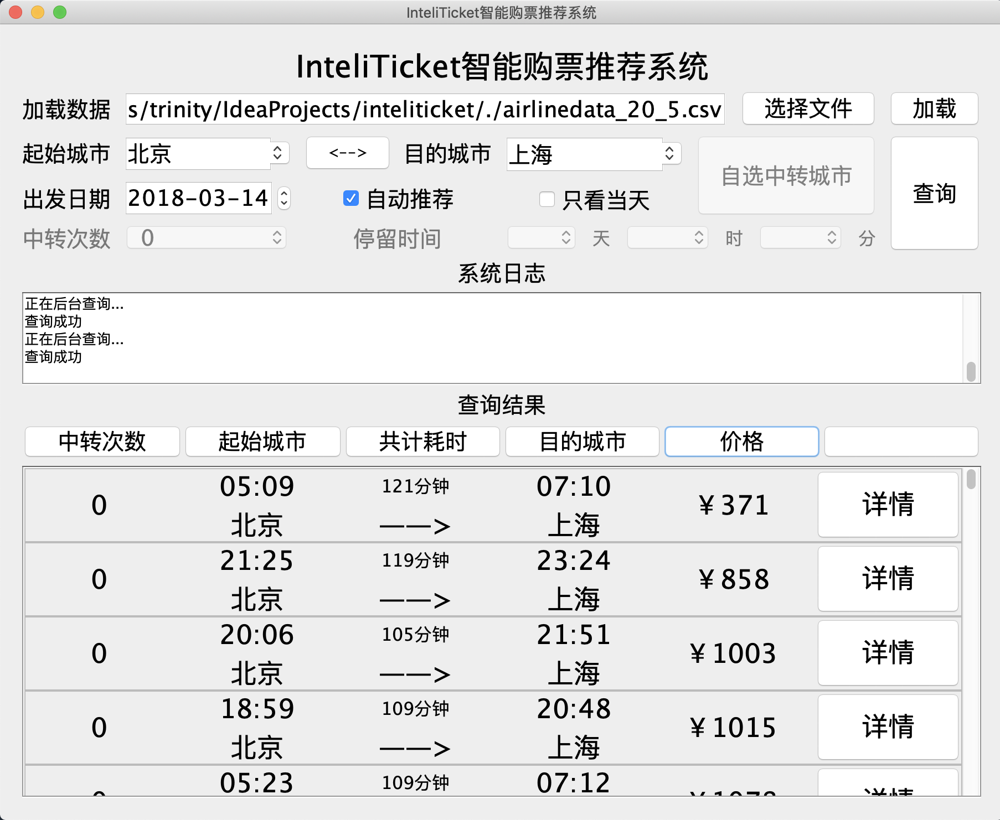

# InteliTicket智能购票推荐工具

## 简介

大二软件设计开发实践课设

## 界面

## 功能

- 根据指定的时间，中转次数，中途停留时间等从现有的航班数据(模拟数据, CSV格式)中自动推荐可选的出行计划。

- 在推荐结果中可以根据 `中转次数`，`共计耗时`，`价格` 排序

- 在详情页显示中转城市

## 算法

- Dijkstra 最短路径算法
- Yen KSP 第K最短路径算法